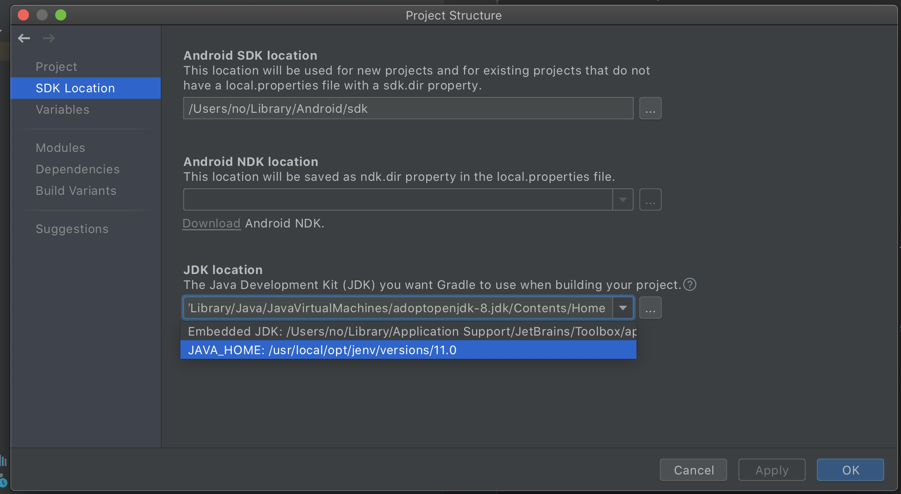

# Java Home Mismatch and Multiple Gradle Daemons

Using a different JDK for command line builds vs Android Studio or IntelliJ builds will cause a new Gradle daemon to
spawn. This will instantly double the memory being used by Gradle.

To fix this issue, we recommend setting your JAVA_HOME environment variable and then using this JAVA_HOME as the JDK
used by Android Studio or IntelliJ.

## Set JAVA_HOME
Set `JAVA_HOME` so that switching between Android Studio and the terminal does not trigger a full rebuild.

To set `JAVA_HOME` (using bash):
`echo \"export JAVA_HOME=${'$'}(/usr/libexec/java_home)\" >> ~/.bash_profile`
or `~/.zshrc` if using `zsh`.

## Using JAVA_HOME from Android Studio:
To Fix:

1. Open Module Settings (F4)

2. Click SDK Location

3. Set JDK location to JAVA_HOME

## View all Gradle Daemons

`jps` will print out all the java processes on the system and the process id (pid).

## Killing Gradle Daemons

`./gradlew --stop` will kill all Gradle Daemons with the current Gradle version.

`pkill -f '.*GradleDaemon.*'` will kill all Gradle Daemons regardless of version.
